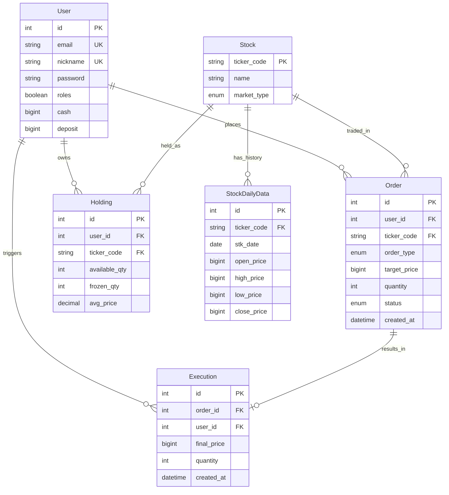

# 📈 StockLab (모의주식투자 및 투자 분석 플랫폼)


**StockLab**은 현대적인 웹 환경에서 데이터 분석과 안정적인 주식 매매를 지원하는 올인원 플랫폼입니다. Flask의 모듈형 아키텍처와 실시간 통신 기술을 활용하여 사용자에게 직관적이고 강력한 투자 도구를 제공합니다.

---

## 📅 프로젝트 정보 (Project Info)
- **작업 기간**: 2026년 3월 20일 ~ 2026년 3월 27일
- **팀원 및 역할**:
  | 담당자 | 역할 | 주요 과업 |
  | :--- | :--- | :--- |
  | **유재복 (PM)** | Execution Engine | Redis 구독 방식의 실시간 체결 엔진 개발, 주문-시세 매칭 및 executions 기록 |
  | **탁유제 (PL)** | Market Data & Admin | KIS API 연동(Redis 토큰 관리), 종목 검색 및 현재가 API, 관리자 대시보드 |
  | **박시원 / 이진영** | Auth & Infrastructure | JWT 기반 회원 인증, 초기 자금(Seed) 지급 로직, users 관리 |
  | **문광명** | Trading System | 지정가 매수/매도 API, 자산 동결 처리, orders 및 holdings 차감 로직 |
  | **강민재** | AI & Analytics | AI 투자 추천 API(Gemini 연동), 수익률 분석 대시보드, 자금 정기 지급 스케줄러 |

---

## ✨ 핵심 기능 (Key Features)

### 1. 통합 대시보드 및 분석 리포트
- **데이터 시각화**: `Charts.js`를 활용한 주가 변동 및 포트폴리오 비중 시각화.
- **분석 시스템**: 진보된 알고리즘을 기반으로 한 종목별 상세 분석 리포트 제공.
- **Vanilla JS 지향**: 복잡한 프레임워크 없이 빠르고 가벼운 사용자 인터페이스 구현.

### 2. 하이브리드 인증 및 보안
- **JWT 기반 인증**: API 통신의 보안을 위해 JSON Web Token을 활용한 세션 관리.
- **안전한 회원 관리**: 암호화된 비밀번호 저장 및 역할 기반 접근 제어(RBAC).

### 3. 실시간 트레이딩 시스템
- **Socket.IO 연동**: 주문 체결 현황 및 시장 상태 변화를 실시간 푸시 알림으로 수신.
- **안정적인 주문 처리**: Flask의 Service Layer 패턴을 적용하여 비즈니스 로직과 데이터베이스 처리 분리.

---

## 🛠 기술 스택 (Tech Stack)

### **Backend**
- **Core**: Python 3.10, Flask
- **ORM**: SQLAlchemy (Flask-SQLAlchemy)
- **Real-time**: Flask-SocketIO
- **Security**: Flask-JWT-Extended, Werkzeug

### **Frontend**
- **Language**: Vanilla JavaScript (ES6+), HTML5, CSS3
- **Templating**: Jinja2
- **Data Visualization**: Charts.js, D3.js

### **Database & Infrastructure**
- **Database**: MariaDB / MySQL
- **Migrations**: Flask-Migrate (Alembic)

---

## 📊 데이터베이스 구조 (ERD)



---

## 📂 프로젝트 구조 (Project Structure)

```text
StockLab/
├── app/
│   ├── api_clients/      # 외부 증권 API 연동 모듈
│   ├── features/         # 비즈니스 로직 (Blueprints)
│   │   ├── auth/         # 인증 및 회원가입
│   │   ├── analysis/     # 데이터 분석 및 리포트
│   │   ├── trading/      # 트레이딩 인터페이스
│   │   └── execution/    # 주문 체결 처리 서비스
│   ├── models/           # SQLAlchemy DB 모델
│   ├── static/           # CSS, JS, Images
│   └── templates/        # Jinja2 HTML 템플릿
├── migrations/           # DB 마이그레이션 이력
├── config.py             # 환경 설정 파일
├── run.py                # 애플리케이션 진입점
└── requirements.txt      # 프로젝트 의존성
```

---

## 🚀 시작하기 (Quick Start)

### 1. 가상 환경 설정 및 패키지 설치
```bash
python -m venv .venv
source .venv/bin/activate  # macOS/Linux
# .venv\Scripts\activate  # Windows
pip install -r requirements.txt
```

### 2. 환경 변수 설정
`.env.example` 파일을 복사하여 `.env` 파일을 생성하고 내용을 수정합니다.
```bash
cp .env.example .env
```

### 3. 데이터베이스 초기화
```bash
flask db upgrade
```

### 4. 실행
```bash
python run.py
```
접속 주소: `http://localhost:5001`

---

## ⚠️ 주의사항
- `.env` 파일은 절대 Git에 커밋하지 마세요.
- 데이터베이스 마이그레이션 변경 시 반드시 `flask db migrate` 후 `upgrade`를 진행하세요.
